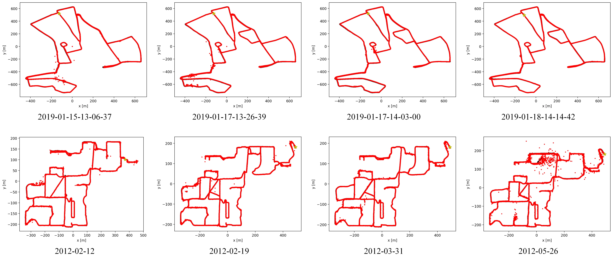

# SGLoc
SGLoc: Scene Geometry Encoding for Outdoor LiDAR Localization

[paper](https://openaccess.thecvf.com/content/CVPR2023/html/Li_SGLoc_Scene_Geometry_Encoding_for_Outdoor_LiDAR_Localization_CVPR_2023_paper.html) 
[video](https://youtu.be/Tek6yA20N7M?feature=shared)

<<<<<<< HEAD

=======

>>>>>>> 37c19f40df4f1db9fb571a76041f80a07175de37

## Visualization


## Environment

- python 3.8.16

- pytorch 1.11.0

- cuda 11.3

```
conda install -f environment.yml
```

## Dataset

We support the [Oxford Radar RobotCar](https://oxford-robotics-institute.github.io/radar-robotcar-dataset/datasets) and [NCLT](https://robots.engin.umich.edu/nclt/) datasets right now.

We also use PQEE to enhance the Oxford and provide the corrected pose, [QEOxford](QEOxford).

The data of the Oxford, QEOxford and NCLT dataset should be organized as follows: 

```
data_root
├── 2019-01-11-14-02-26-radar-oxford-10k
│   ├── xxx.bin
│   ├── xxx.bin
├── Oxford_pose_stats.txt
├── train_split.txt
├── valid_split.txt
```

## Data prepare
We use [SPVNAS](https://github.com/mit-han-lab/spvnas) for data preprocessing (just used for training) and generate corresponding planar masks. You need to download the code for SPVNAS and run the [data_prepare.py](code/data_prepare.py) we provided within it.

## Run

### train
```
python train.py --dataset_folder xxx
```

### test
```
python test.py --dataset_folder xxx --resume_model checkpoint_epoch_xxx.pth
```

## Model zoo

Our pretrained model will soon be made public.

## Acknowledgement

 We appreciate the code of [PosePN](https://github.com/PSYZ1234/PosePN) and [STCLoc](https://github.com/PSYZ1234/STCLoc) they shared.

## Citation

```
@inproceedings{li2023sgloc,
  title={SGLoc: Scene Geometry Encoding for Outdoor LiDAR Localization},
  author={Li, Wen and Yu, Shangshu and Wang, Cheng and Hu, Guosheng and Shen, Siqi and Wen, Chenglu},
  booktitle={Proceedings of the IEEE/CVF Conference on Computer Vision and Pattern Recognition},
  pages={9286--9295},
  year={2023}
}
```
